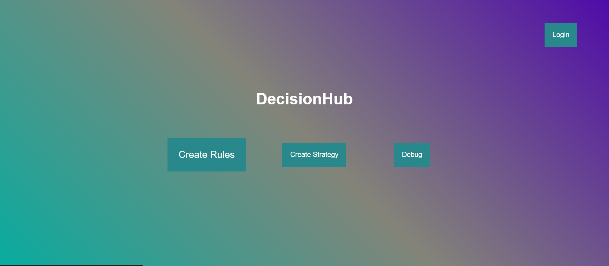
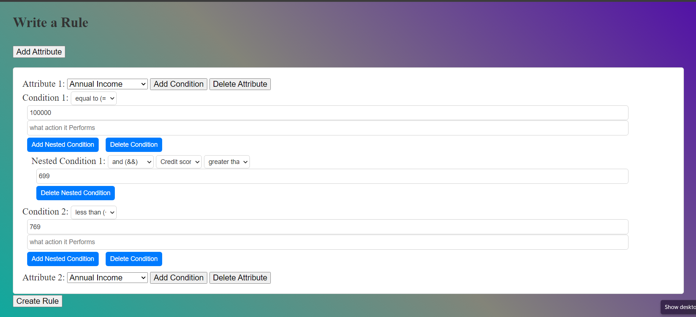

# DecisionHub

[](https://opensource.org/licenses/MIT)
[](https://www.python.org/downloads/)
[](https://flask.palletsprojects.com/)

> A powerful AI-powered decision support tool for loan approval prediction and client analysis.

DecisionHub is designed to assist analysts in making informed decisions about potential clients quickly and efficiently. This project was developed during a hackathon with the aim of streamlining the decision-making process by incorporating relevant parameters and data points.



## ✨ Features

- **🤖 AI-Powered Loan Prediction** - Machine learning model (XGBoost) analyzes loan factors and predicts approval chances
- **📊 Parameterized Analysis** - Define and customize parameters relevant to your decision-making process
- **🔍 Rejection Insights** - Get clear reasons for declined applications and areas for improvement
- **⚡ Real-time Data Integration** - Access the most up-to-date information when evaluating clients
- **🎯 User-Friendly Interface** - Intuitive design for easy navigation and analysis
- **📈 Scalability** - Built to accommodate growing needs and increasing client volume

## 🚀 Quick Start

### Prerequisites

- Python 3.8 or higher
- pip (Python package manager)

### Installation

1. **Clone the repository**
   ```bash
   git clone https://github.com/DEADSAW/DecisionHub.git
   cd DecisionHub
   ```

2. **Create a virtual environment** (recommended)
   ```bash
   python -m venv venv
   source venv/bin/activate  # On Windows: venv\Scripts\activate
   ```

3. **Install dependencies**
   ```bash
   pip install -r requirements.txt
   ```

4. **Run the application**
   ```bash
   python app.py
   ```

5. **Access the application**
   Open your browser and navigate to `http://localhost:5000`

## 📖 Usage

### Loan Prediction Tool

1. Navigate to the loan approval form
2. Fill in the applicant's details:
   - Personal information (name, gender, education)
   - Employment status
   - Income details (applicant and co-applicant)
   - Loan amount and term
   - Credit history
   - Property area
3. Submit the form to get an instant prediction



### Creating Rules & Strategies

Use the Create Rules and Strategy features to define custom decision-making parameters:

- **Create Rules**: Define individual decision rules based on specific criteria
- **Create Strategy**: Combine multiple rules into comprehensive evaluation strategies
- **Debug/Test**: Test your rules and strategies against sample data

## 📁 Project Structure

```
DecisionHub/
├── app.py                 # Flask application entry point
├── requirements.txt       # Python dependencies
├── bin/                   # ML model binaries
│   └── xgboostModel.pkl   # Trained XGBoost model
├── data/                  # Data files and schemas
│   ├── columns_set.json   # Feature columns configuration
│   ├── loan_train.csv     # Training dataset
│   ├── loan_test.csv      # Test dataset
│   └── *.csv              # Sample data files
├── scripts/               # Utility scripts
│   └── generate_sample_data.py  # Script to generate sample data
├── static/                # Static assets for Flask app
│   ├── css/
│   ├── fonts/
│   └── images/
├── template/              # Flask HTML templates
│   ├── index.html         # Main prediction form
│   ├── prediction.html    # Prediction results
│   └── error.html         # Error page
├── frontend/              # Frontend pages and assets
│   └── pages/             # HTML, CSS, JS files
├── notebook/              # Jupyter notebooks
│   └── Machine Learning Model Dev.ipynb
├── docs/                  # Documentation
│   └── images/            # Screenshots and images
├── CONTRIBUTING.md        # Contribution guidelines
├── LICENSE                # MIT License
└── README.md              # This file
```

## 🛠️ Technologies Used

- **Backend**: Python, Flask
- **Machine Learning**: XGBoost, scikit-learn, pandas, numpy
- **Frontend**: HTML5, CSS3, JavaScript
- **Model Serialization**: joblib

## 🤝 Contributing

We welcome contributions! Please see our [Contributing Guidelines](CONTRIBUTING.md) for details on how to:

- Report bugs
- Suggest features
- Submit pull requests

### Quick Steps

1. Fork the repository
2. Create a feature branch (`git checkout -b feature/amazing-feature`)
3. Commit your changes (`git commit -m 'Add amazing feature'`)
4. Push to the branch (`git push origin feature/amazing-feature`)
5. Open a Pull Request

## ⚠️ Known Issues

- DecisionHub is still in active development
- Some features may be under construction
- We appreciate your feedback on any issues encountered

## 📝 License

This project is licensed under the MIT License - see the [LICENSE](LICENSE) file for details.

## 👥 Authors

- **Sangam Rai** - *Initial work* - [DEADSAW](https://github.com/DEADSAW)

## 🙏 Acknowledgments

- Built during a hackathon with the goal of streamlining decision-making processes
- Thanks to all contributors who have helped improve this project

---

<p align="center">Made with ❤️ for better decision making</p>
